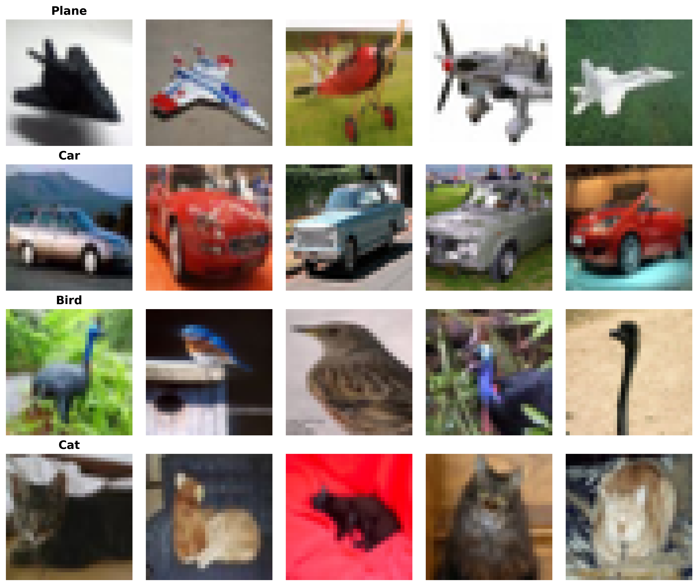
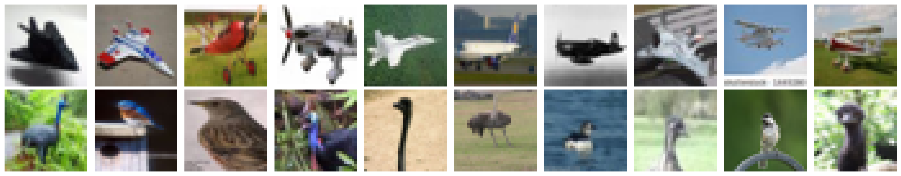
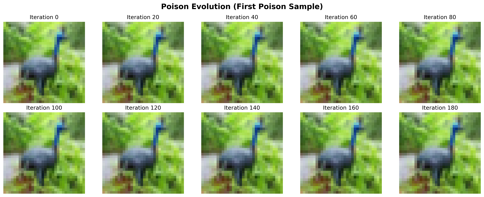
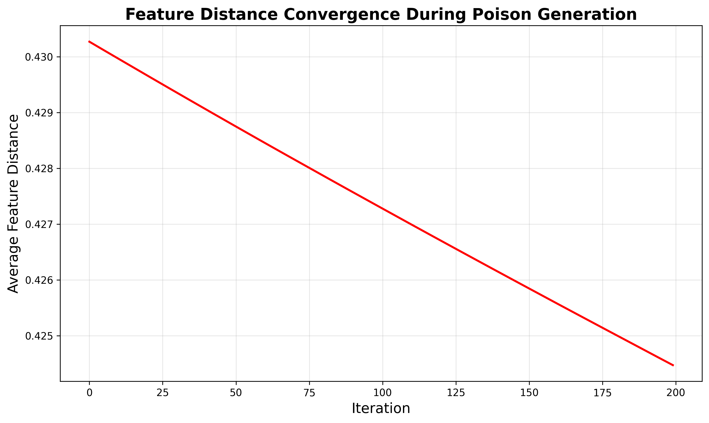
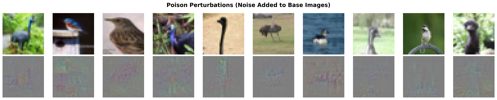
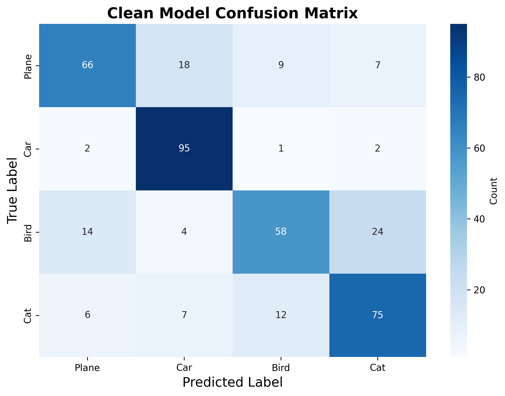
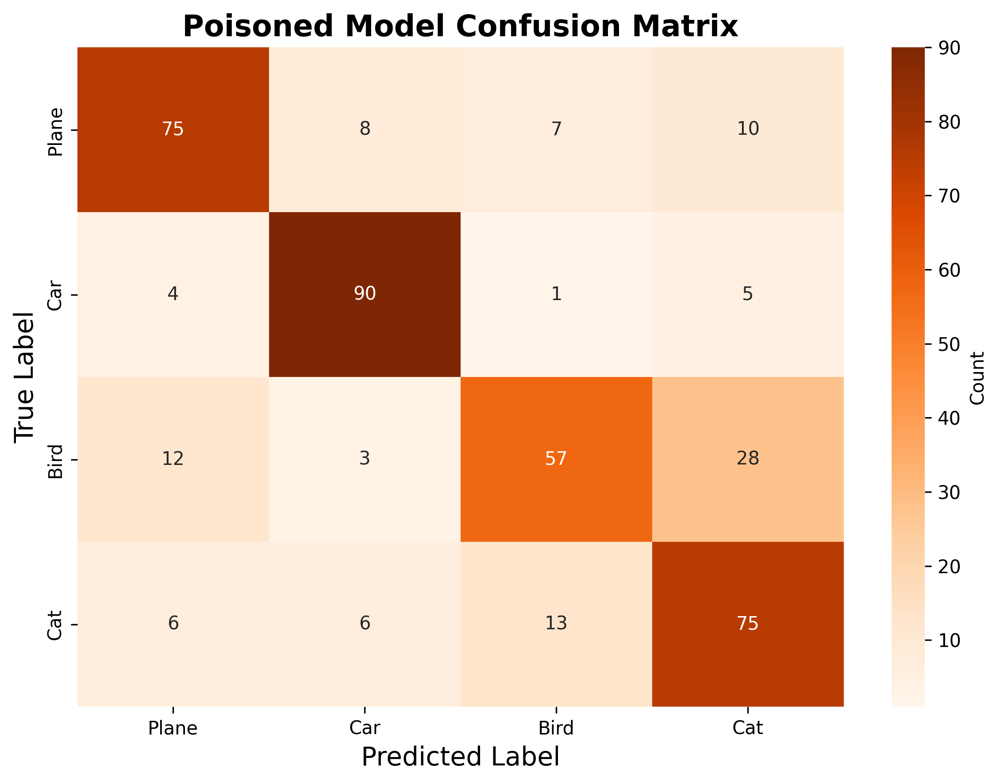
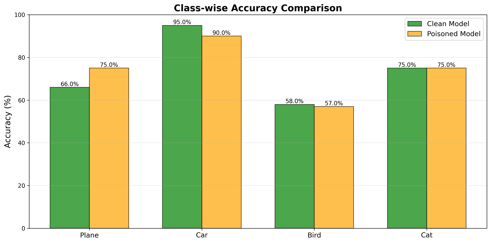
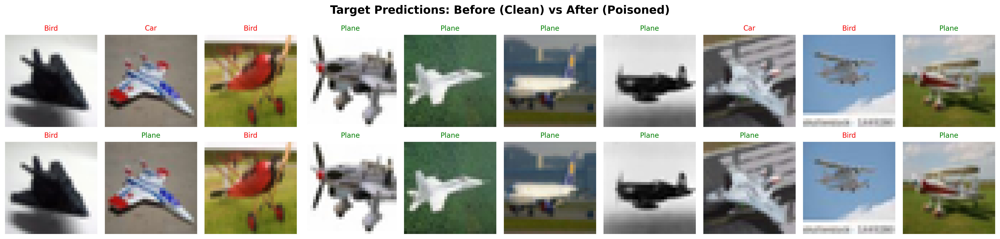
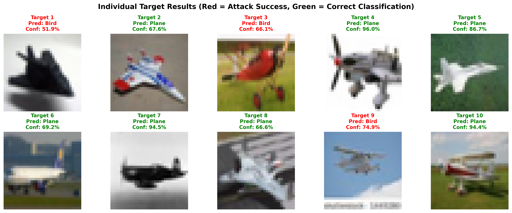

# Clean-label poisoning on CIFAR-10

This repo contains a small clean-label poisoning experiment on a four-class CIFAR-10 subset. The goal is simple: keep the poisoned images labeled as Bird, but push a CNN into classifying selected Plane targets as Bird after retraining.

## Overview

The experiment uses four CIFAR-10 classes: Plane, Car, Bird, and Cat. Ten Plane images are held out as targets. Ten Bird images are used as bases for the poison images. The poisons stay visually close to the Bird bases while their feature representations move toward the Plane targets.

This is the part I wanted to test: can a small number of label-consistent poisons change specific predictions without wrecking overall accuracy? In this run, yes, but only partly.

## Repository structure

```text
.
├── README.md
├── requirements.txt
├── data/
│   ├── README.md
│   └── cifar-10-python/
├── figures/
├── notebooks/
│   ├── 01_cifar10_subset_preparation.ipynb
│   ├── 02_clean_model_and_poison_generation.ipynb
│   └── 03_poisoned_retraining_and_evaluation.ipynb
└── report/
    └── clean_label_poisoning_report.pdf
```

## Tech stack

- Python
- PyTorch and torchvision
- NumPy
- Matplotlib
- Jupyter Notebook

## Method

### Data setup

The experiment uses 500 training images per class and 100 test images per class. Plane is the target class. Bird is the base class.



The held-out Plane targets are not used during clean training. The Bird bases stay in the training set and are used to create the poisons.



### Poison generation

Each poison starts as a Bird image. During optimization, the image is nudged so its CNN feature vector moves closer to the matching Plane target. Pixel changes are clipped, so the poison still looks like the original Bird image.



The feature distance drops during optimization, which is the main signal that the feature-collision step is doing what it should.



The perturbations are small in the original image scale. The plot below magnifies them so the pattern is visible.



## Results

| Metric | Clean model | Poisoned model |
|---|---:|---:|
| Test accuracy | 73.5% | 74.3% |
| Plane accuracy | 78.0% | 75.0% |
| Bird accuracy | 60.0% | 57.0% |
| Target success | 0/10 | 3/10 |

The poisoned model keeps roughly the same test accuracy, but three of the ten held-out Plane targets flip to Bird. That is the main result of the experiment.





The class-wise view shows that the attack does not collapse the whole model. The target class shifts, but the overall model still behaves like a usable classifier on the four-class test set.



The per-target plot is more useful than the headline accuracy. It shows exactly which targets flipped after poisoned retraining.





## Running the notebooks

Create an environment and install the dependencies:

```powershell
python -m venv .venv
.\.venv\Scripts\Activate.ps1
pip install -r requirements.txt
jupyter notebook
```

Run the notebooks from the repo root in this order:

1. `notebooks/01_cifar10_subset_preparation.ipynb`
2. `notebooks/02_clean_model_and_poison_generation.ipynb`
3. `notebooks/03_poisoned_retraining_and_evaluation.ipynb`

The notebooks create intermediate files such as `step1_data.pt`, `poisons.pt`, and model checkpoints. Those files are generated artifacts and are not tracked.

## Limitations

This is a compact experiment, not a full attack benchmark. It uses one small CNN, four CIFAR-10 classes, ten targets, and ten poisons. A stronger attack would need more runs, more architectures, and a better sweep over poison count, perturbation budget, and optimization steps.

## Report

The report is available at `report/clean_label_poisoning_report.pdf`.
